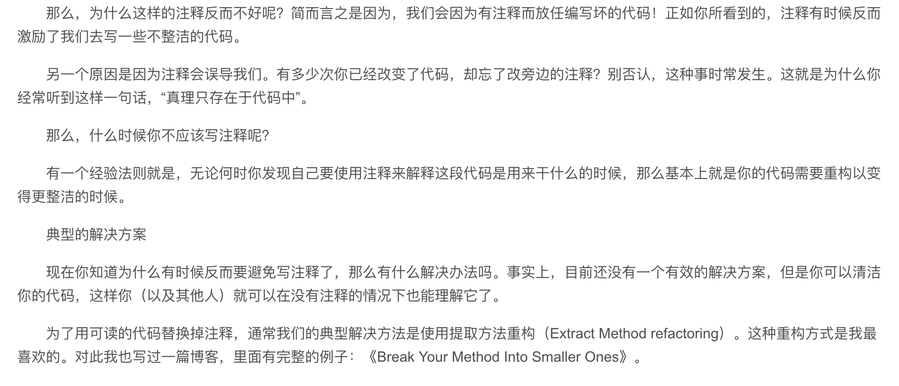

# 注释规范

## 什么东西应该注释？

写注释固然很重要，但是很多时候我们真的需要注释吗？在你写注释前，好好想一下这个问题。以下图片截取自：[什么时候应该避免写代码注释？](https://blog.csdn.net/xishining/article/details/78993970)


所以很多时候我们写的都是一些没有用的注释，还会误导人！所以，总的来说，有必要写注释的主要有：

**1、公共的函数方法、常量和重要变量的定义**。

**2、业务系统中，晦涩难懂的需求**。

**3、多步骤的流程。最好用1，2，3，4··· 标明顺序**。

**4、复杂的算法**。

其他没有用的东西直接删除，保持代码的整洁性。不要用注释的办法来设法回退，那是 git 版本管理等工具应该完成的事情。

## 注释的格式

### HTML注释

在 html 中主要使用的注释方式就只有一个：```<!-- write your HTML comment! -->```

> 注意在注释的前后各有一个空格。

### CSS注释

在 CSS 中，注释的方式主要有：```\* write your CSS comment! *\```

> 注意在注释的前后各有一个空格。

### Javascript

在 JS 中，因为注释的东西，内容比较多，按照前面列出的功能，分别说明。

#### 行级注释

**行级注释就是指的双正斜线后面的内容，双线后面需呀放置一个空格**。

```javascript
// 正确的注释
//错误的注释，双斜线后面没有空格
```

#### 变量声明注释

**1、如果是在类似 Vue 项目的 data 属性中的变量，直接用行级样式跟在后面**。

```javascript
data () {
  return {
    rightExample: 'yes', // 注释直接写这里
    // 我是 errorExample 变量的注释，错误形式
    errorExample: 'no'
  }
}
```

**2、如果是在类，构造函数，或者常量定义中的变量，使用块级注释**。

```javascript
/**
* 错误码常亮定义
* @type {number}
*/
const ERR_CODE = 0
```

#### 函数声明注释

不必要在每一个函数都写注释，但是在公共函数，还是建议补全注释，让后面的人不需要重复早轮子。

**函数头注释中必须写以下内容**：

- 函数的功能
- 函数的入口参数类型
- 函数的返回值类型
- 函数的算法或者业务逻辑

```javascript
/**
 * 获取 DOM data 属性的值
 * @param {DOM} el dom对象
 * @param {String} name 需要获取属性的名字
 * @param {String, Number} val 可选，存在是表示设置属性的值
 * @returns {String}
 */
function getData (el, name, val) {
  const prefix = 'data-'
  let prop = prefix + name
  if (val) {
    el.setAttribute(prop, val)
  } else {
    return el.getAttribute(prop)
  }
}
```

参考资料：
[https://jingyan.baidu.com/article/3ea51489abc0f152e61bba2e.html](https://jingyan.baidu.com/article/3ea51489abc0f152e61bba2e.html)
[https://www.jianshu.com/p/1a0cf697b9bb](https://www.jianshu.com/p/1a0cf697b9bb)
