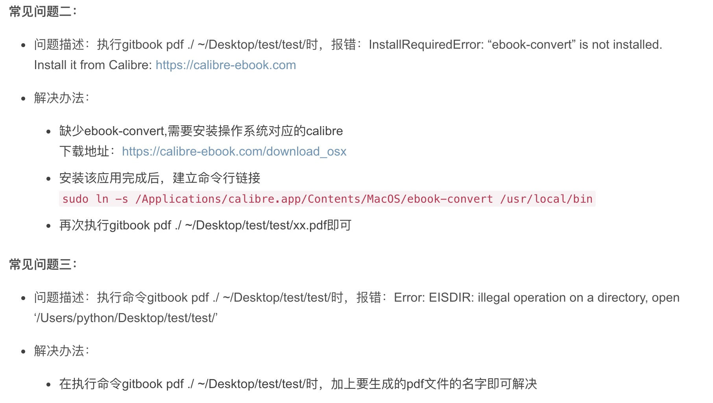

# GitBook 的使用说明

这篇文章的内容，主要参考了网友的博客，感觉写的很详细，想阅读原文的可以进去看看：[GitBook 从懵逼到入门](https://blog.csdn.net/lu_embedded/article/details/81100704)

## 什么是 GitBook？

> GitBook 是一个基于 Node.js 的命令行工具，支持 Markdown 和 AsciiDoc 两种语法格式，可以输出 HTML、PDF、eBook 等格式的电子书。所以我更喜欢把 GitBook 定义为文档格式转换工具。

## 如何使用？

**1、安装 node.js**.

**2、安装 GitBook：**```npm install -g gitbook-cli```

> MAC OS 用户：sudo npm install -g gitbook-cli，然后输入密码，回车

**3、初始化一个 GitBook 的项目**：```gitbook init```

> 然后目录下面就会多出来两个目录：

   README.md &nbsp;&nbsp;&nbsp;—— 书籍的介绍写在这个文件里
   SUMMARY.md —— 书籍的目录结构在这里配置
 有了这些文件夹，你就可以在对应目录创建自己的 markdown 文件了，开始自己的写作之路！

 **4、执行：**```gitbook serve``` **命令，在本地开启一个开发预览模式**。开发体验和 Vue 的项目是一样的，编辑器编写，然后自动实现开发热加载，在浏览器中实时查看效果。

 > 关于编辑器，只要能写就行。不过推荐使用 Markdown 的编辑器。首先语法层面支持良好，还有各种提示。还有就是和用 word 写文档一样，所见即得。

 **5、创作完毕，构建最终产品：**```gitbook build```

 > ```gitbook build```: 构建的是可以部署在服务器上的 HTML 文件；

   ```gitbook pdf```: 最终输出一个 PDF 的产品
   ```gitbook mobi```: 构建成电子书
   后面的两种方式需要一个安装一个第三方的插件：calibre，自己百度安装。然后配置对应的环境路径。

## 使用过程中遇到的问题

**注意：以下截图出自**：[https://blog.csdn.net/Hulu_IT/article/details/84977390](https://blog.csdn.net/Hulu_IT/article/details/84977390)

> 需要复制命令的，自行点开连接。并且针对 MAC OS 的用户使用，Windows 配置环境变量，自己百度。



**还有一个比较关心的问题：在项目中，我们都有一个：package.json 文件来管理我们的依赖，在 gitbook 中没有这个文件，取而代之的是：book.json。
关于里面详细的配置项，推荐你看下面的：*gitbook 实用配置及插件介绍*。如果里面的东西还不能满足你的需求，你可以谷歌或百度你需要的插件。

`最后放上两个自己平时用的最多的，关于gitbook 的使用，配置的连接：`

1、[gitbook 的详细介绍](https://github.com/downgoon/hello-world/wiki/how-to-gitbook)

2、[gitbook 实用配置及插件介绍](https://www.cnblogs.com/zhangjk1993/p/5066771.html)
