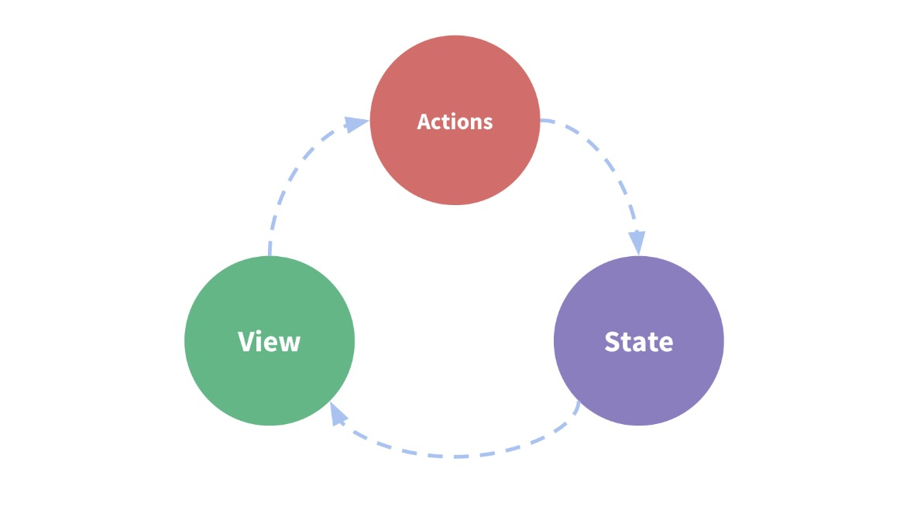

# 第一步：数据源（State）

按照官网的说法：**Vuex 使用单一状态树——是的，用一个对象就包含了全部的应用层级状态。**

> 简单理解：Vuex 是一个全局的对象，对象里有 **专门存放数据的地方** 和 **一些特殊的方法**。专门存放数据的地方就是一个对象，对象的 键(key) 事先已声明，不能动态添加和删除。键(key) 对应的 值(value) 只能通过特殊的方法修改和读取。

所以我们首先应该创建一个数据源（state）存放数据，然后在定义读取和修改数据的方法。初始化很简单，就像这样：

```javascript
// state.js
const State = {}
export default State
```

我们声明了一个对象，并把它暴露出来。目的是为了让数据源独立出来，以便日后**更好的维护和模块化**。
> 这里有一个比较容易混淆的点，就是：**数据中心（store）和 **数据源（state）的关系。特别是在后面传参数的是时候，什么时候传递的是 store，

什么时候是 state 一定要做好区分：
**store** 是数据中心的实例，能够访问到所有数据中心的数据；
**state** 只是数据源，是 store 中的一个属性，牢记它们区别。

## 数据中心关系图

数据中心里面的数据是响应式的，并且单向流动，先放一张图日后参考。随着你理解的深入，我觉得它会很有用。



## 实现购物车案例

我们来实现前面说的购物车。我们可以在 State 里面添加一个变量，保存购物车的数据，就像这样：

```javascript
// state.js
const State = {
  cardData: [] // 保存购物车的数据，所有键(key) 必须在这里事先声明
}
export default State
```

我们有了数据源，接下来我们看看：[如何修改 State 中的数据](./mutations.md)。
