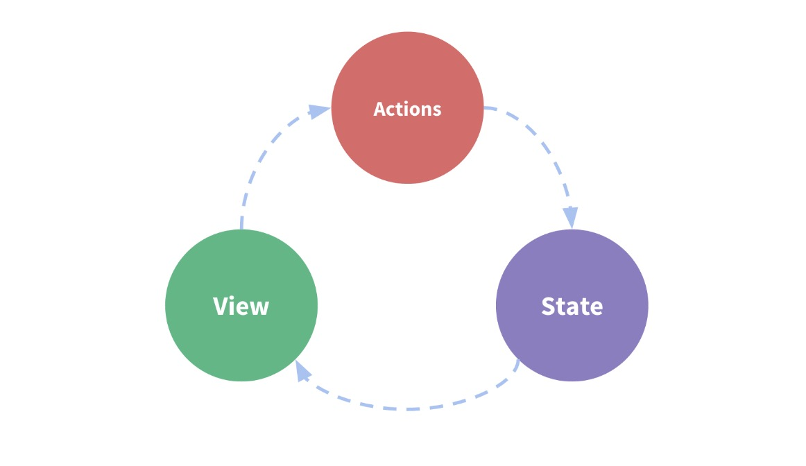

# 第一步：数据中心（State）

首先你应该在脑海里有一个认知，数据中心（Vuex）是什么？<br/>
按照官网的说法：Vuex 使用单一状态树——是的，用一个对象就包含了全部的应用层级状态。<br/>
简单理解就是：它一个全局的对象。只是这个对象有点特殊，挂载了很多的变量，你不能直接修改，必须通过特定的方法读取/修改它们。
那么，既然这个变量是全局的，这就意味着，一个应用里面只会拥有一个数据中心的实例。我们按照习惯，用 store 表示。

好了，有了这个认识，我们回到主题，讲解 Vuex 的数据源：State.

首先我们应该创建一个数据源（state），它是数据中心的核心部分，存放数据的地方。初始化很简单，就像这样：
```javascript
// state.js
const State = {}
export default State

```
我们声明了一对象，并把它暴露出来。目的是为了让数据源独立出来，以便日后**更好的维护**，**和模块化**。
> 这里有一个比较容易混淆的点，就是：**数据中心（store）**和 **数据源（state）**的关系。特别是在后面传参数的是时候，什么时候传递的是 store，
什么时候是 state 一定要做好区分：<br/>
**store** 是数据中心的实例，能够访问到所有数据中心的数据；<br/>
**state** 只是数据源，是 store 中的一个属性，牢记它们区别。



<br/>
我们来一步步实现前面说的购物车。我们可以在 State 里面添加一个变量，保存购物车的数据，就像这样：
```javascript
// state.js
const State = {
  cardData: [] // 保存购物车的数据
}
export default State
```
好了，到这里，关于 state 的东西就这么多，比较简单。还是那句话，如果你还是不懂，可以先去参考官网的：[Vuex](https://vuex.vuejs.org/zh/) 部分。

我们有了数据源，接下来我们看看：[如何向 State 中添加数据](./mutations.md)。

